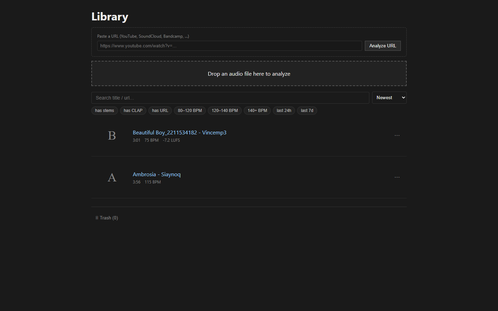
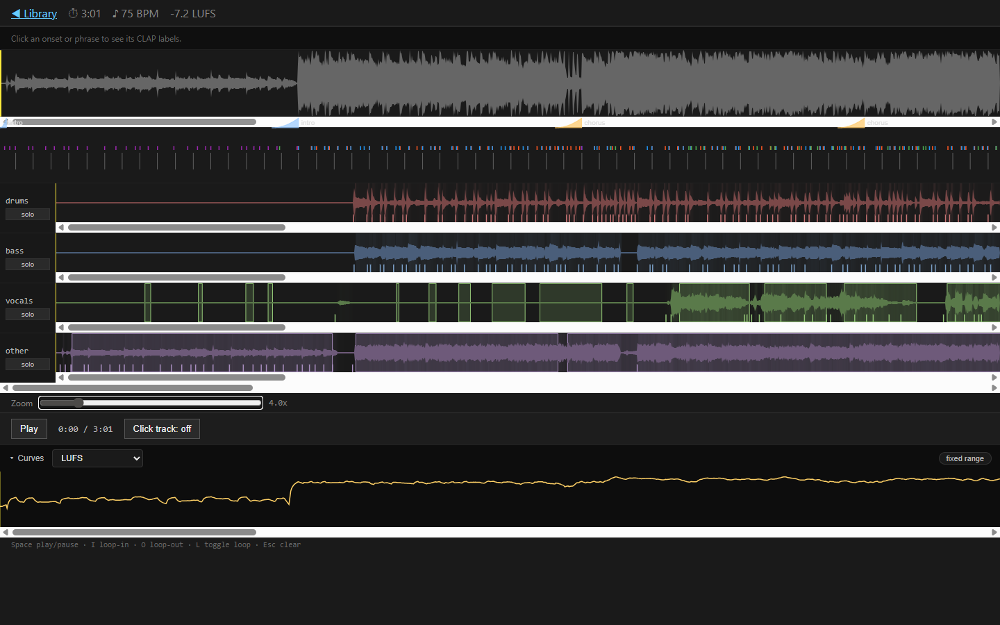
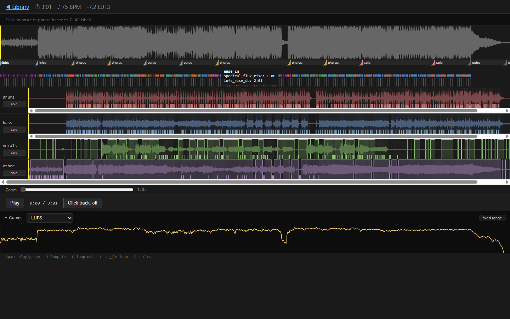
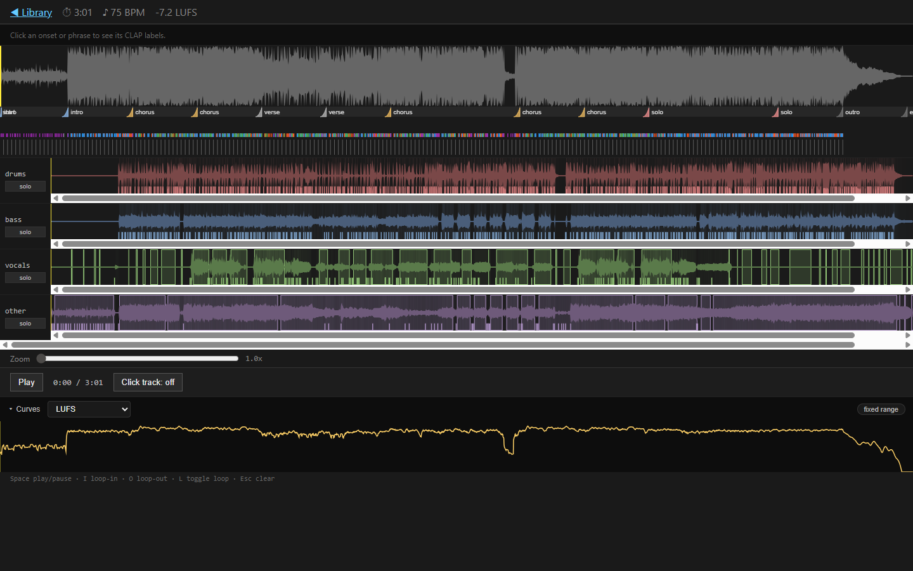
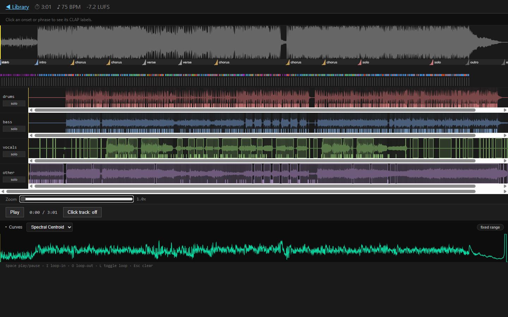
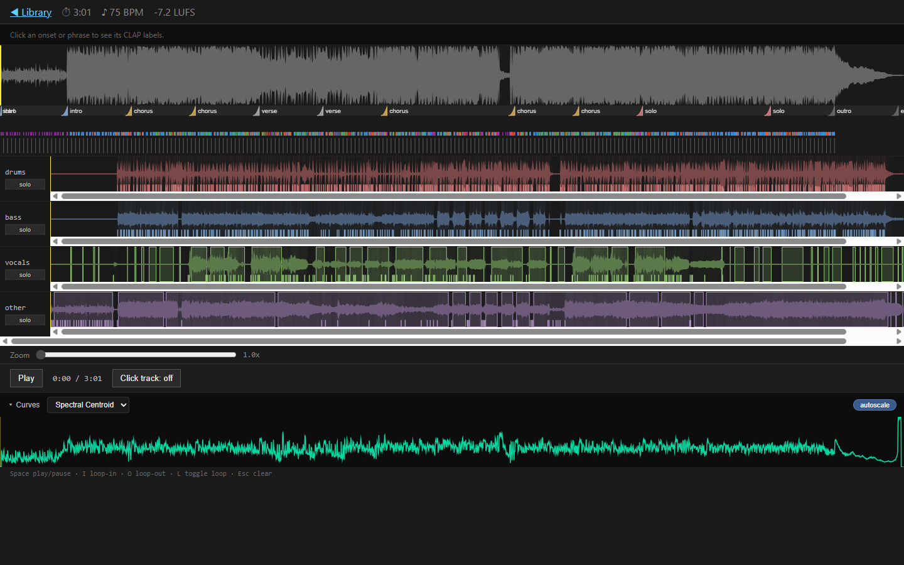
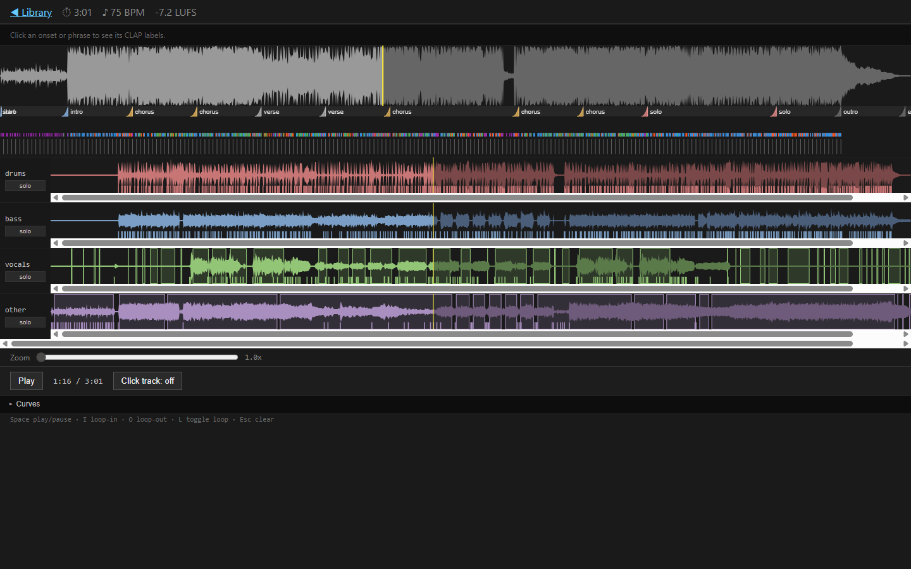
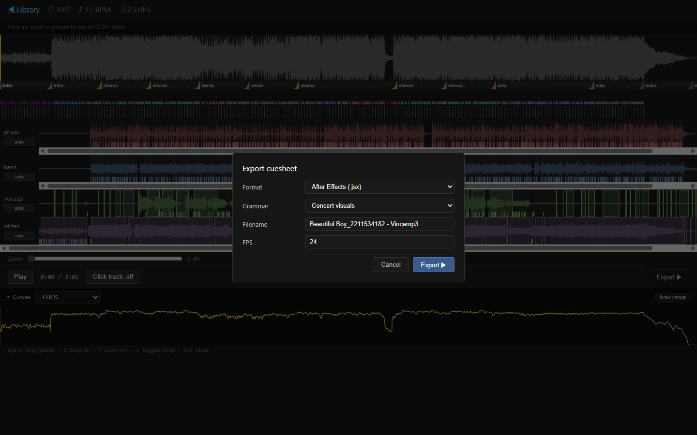
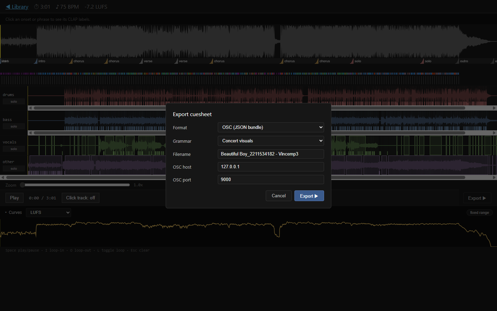
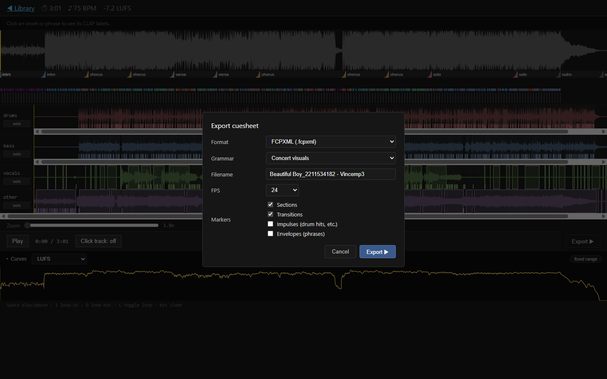

# MusiCue

https://github.com/user-attachments/assets/16a00b67-fab0-4b35-b021-98032cf68f5c

Convert songs into typed event timelines for DCC tools.

MusiCue is a three-layer pipeline that takes an audio file and produces a structured **cuesheet** — a timeline of impulses, envelopes, ramps, steps, and continuous curves — ready to drive animation, lighting, video, and live-show tools.

## How it works

```
audio.wav ─► [Layer 1: Analyze] ─► analysis.json ─► [Layer 2: Compile] ─► cuesheet.json ─► [Layer 3: Export] ─► <target format>
```

- **Layer 1 (Analysis)** — Demucs source separation, All-In-One beat/section detection (with librosa fallback), librosa onset detection, Basic Pitch polyphonic MIDI, phrase grouping, CLAP semantic re-ranking, LUFS + spectral curves, stereo width/pan, section transition ramps. GPU-accelerated where available; gracefully degrades when optional ML packages are missing.
- **Layer 2 (Compile)** — A YAML grammar DSL turns the analysis into a typed cuesheet. Filter expressions (`drum_class == 'kick'`, `any_label('sub bass drop', min_score=0.6)`, `near_downbeat(0.05)`), per-track scoring with multipliers, hierarchy weights, rarity decay, cooldowns. Four built-in grammars: `concert_visuals`, `character_animation`, `lighting`, `camera_edit`.
- **Layer 3 (Export)** — Nine target formats: CSV, JSON, MIDI, After Effects (.jsx), TouchDesigner (CHOP CSV + events), OSC bundle, Houdini CHOP CSV, disguise/DMX cue list, Unreal Sequencer JSON.

## Installing MusiCue (Windows)

MusiCue ships a one-click installer for Windows that sets up Python, all
dependencies, ffmpeg, and the ML model weights.

**What you need before you start**

- A Windows 10 or 11 PC.
- An NVIDIA GPU (any RTX or recent GTX card). MusiCue installs the
  CUDA-enabled version of PyTorch; without an NVIDIA GPU, the app still
  runs but stem separation will be slow.
- Roughly 6 GB of free disk space for Python, dependencies, and model
  weights, plus more for your songs and analyses.
- A working internet connection (the installer downloads several large
  files; expect 5–20 minutes for a first install).

**Step 1 — Get the code**

Download or `git clone` this repository to a folder you control, for
example `D:\MusiCue\`.

**Step 2 — Run the installer**

Double-click `install.bat`. A console window opens and walks through:

1. Installs `uv` (the modern Python package manager, ~15 MB).
2. Creates a project-local Python 3.11 environment in `.venv\`.
3. Installs MusiCue and all dependencies, including the GPU build of
   PyTorch (~2 GB).
4. Tries to install CLAP (semantic labels) and All-In-One (section
   detection). These are optional — if either fails, the installer
   notes a warning and continues. MusiCue still works without them; the
   readiness chip in the UI shows them as missing so you can decide
   later whether to fix.
5. Downloads a portable ffmpeg into `vendor\ffmpeg\` (only if you don't
   already have ffmpeg on PATH).
6. Pre-downloads the Demucs (~320 MB) and CLAP (~4 GB) model weights.
7. Prints a readiness table showing which components are ready.

Once the installer says "Install complete," close the window.

**Step 3 — Launch MusiCue**

Double-click `run.bat`. A console window opens, starts the server, and
prints the URL. Open `http://127.0.0.1:8000/library` in your browser.

In the top right of every page you'll see a small **readiness chip**:

- **Green** — every model is downloaded and ready.
- **Amber** — optional pieces (All-In-One or CLAP) are missing. The
  app still works; some features (section detection, semantic labels)
  will be unavailable.
- **Red** — a required piece is missing (Python, ffmpeg, Demucs, or
  Basic Pitch). Click the chip to see exactly what's wrong, then run
  `install.bat` again to fix it.

Click the chip to open the **Recheck** popover, which lists each
component, its state, and the exact command to fix it manually if you
prefer.

**What the installer does NOT do for you**

- It does **not** install an NVIDIA driver. If `nvidia-smi` doesn't
  work in a fresh console, install the latest NVIDIA Game Ready driver
  from `nvidia.com` first, then re-run `install.bat`.
- It does **not** create desktop or Start Menu shortcuts. If you want
  one, right-click `run.bat` and choose **Send to → Desktop (create
  shortcut)**.
- It does **not** update MusiCue itself. To update, `git pull` (or
  re-download the repo) and run `install.bat` again — it's idempotent
  and skips work that's already done.
- It does **not** auto-fix Allin1 if it failed. Allin1 has finicky
  Windows-native dependencies; if the readiness chip shows it as
  missing, see `FOLLOWUPS.md` for the current workaround.

## For developers (other operating systems)

If you're on macOS or Linux, or you want a development install on
Windows without the installer, the path is:

```powershell
# Create a venv however you prefer (uv, conda, python -m venv).
pip install -e ".[dev,ui,midi,osc]" basic-pitch
pip install -e ".[clap]"      # optional, ~4 GB of weights on first use
pip install allin1             # optional, Linux/macOS install is easier
```

Then start the dev server with `python -m uvicorn musicue.ui.server:create_app --factory`.

Run `python -m musicue.health.readiness --print-table` at any time to
print the same readiness table the chip shows.

## CLI quick reference

```powershell
# Render a song to a TouchDesigner CHOP CSV in one shot
musicue render song.wav --target touchdesigner --out song_td.csv

# Or step through the pipeline manually
musicue analyze song.wav --out runs/song/
musicue inspect runs/song/analysis.json
musicue compile runs/song/analysis.json --grammar concert_visuals --out cuesheet.json
musicue export cuesheet.json --target after_effects --out cuesheet.jsx
```

## CLI commands

| Command | Purpose |
|---|---|
| `musicue analyze <song>` | Layer 1 — write `analysis.json` |
| `musicue compile <analysis.json>` | Layer 2 — write `cuesheet.json` |
| `musicue export <cuesheet.json> --target <name>` | Layer 3 — emit target format |
| `musicue render <song>` | All three layers in one shot |
| `musicue render <dir> --batch --workers 4` | Parallel batch over a directory |
| `musicue inspect <analysis.json>` | Print human-readable summary |
| `musicue plot <analysis.json> --out plot.png` | Render matplotlib timeline |
| `musicue listen <cuesheet.json> --audio <song.wav>` | Render QC click-track WAV |
| `musicue diff <a.json> <b.json>` | Compare two cuesheets per-track |

## Built-in grammars

- **`concert_visuals`** — downbeat pulse, per-class drum tracks, drop labels, vocal phrase envelopes, section ramps, energy curve
- **`character_animation`** — vocal/melody phrase envelopes, downbeat accents, per-stem energy
- **`lighting`** — fast attack drum tracks, hihat with rarity decay, build-up cues, intensity curve
- **`camera_edit`** — section cuts as primary, downbeat bar markers, impact hits, slow energy curve

Custom grammars are plain YAML — see `musicue/grammars/concert_visuals.yaml` for the format.

#### Beat patterns and phrase-aware grammar *(v0.2c)*

Every `BeatEvent` in `analysis.json` carries pattern-aware fields populated automatically at the end of the analysis pipeline:

- **`phrase_id` / `phrase_position` / `phrase_length`** — which 4/8/16-bar phrase block this beat belongs to and where in it the beat sits.
- **`is_fill`** — true on bars whose drum-onset density spikes (1.5σ above the mean) at a phrase ending. Flag for the "drum fill before the chorus" idea.
- **`syncopation`** — per-bar fraction of off-beat onset strength. Higher = more syncopated bar.

Top-level `analysis.patterns` exposes the underlying detections (`phrases`, `fills`, `syncopation_per_bar`) for tools that want to consume them directly.

Grammar filter expressions gain the matching primitives:

```yaml
- name: phrase_pulse
  type: impulse
  source: beats
  filter: "is_phrase_start()"            # first bar of every phrase
- name: fill_flash
  type: impulse
  source: beats
  filter: "is_fill()"                    # drum-density fills only
- name: every_8_bars
  type: impulse
  source: beats
  filter: "every_nth(8, offset=0)"       # bars 0, 8, 16, …
```

Existing comparison primitives (`>=`, `>`, `<=`, `<`) work directly on `phrase_position`, `phrase_length`, and `syncopation` — e.g. `filter: "syncopation > 0.4"` to fire only on syncopated bars. `concert_visuals` ships with `phrase_pulse` and `fill_flash` examples.

The detection is heuristic — no ML, no new dependencies. Phrase blocks come from greedy bar-window autocorrelation (4/8/16 candidate periods); fills from a per-bar onset z-score; syncopation from on-beat-vs-off-beat onset-strength ratios. Songs in free-time / rubato sections will get low-confidence phrases, which is fine — pattern-aware filters silently no-op when the data isn't strong.

## Exporters

| Target | Output | Notes |
|---|---|---|
| `csv` | Single CSV with `time_sec` column | Generic time-series |
| `json` | Pydantic-validated JSON | Round-trip safe |
| `midi` | Standard MIDI file | Impulse→GM drum notes, continuous→CC74, step→meta markers |
| `after_effects` | ExtendScript `.jsx` | Null layers + Slider Control keyframes + comp markers |
| `touchdesigner` | CHOP CSV + events CSV | `time` column convention, plus Table DAT events |
| `osc` | JSON bundle + `play_osc.py` | UDP playback script bundled |
| `houdini` | CHOP-compatible CSV | Metadata header, `time` channel, per-track channels |
| `disguise` | Cue list CSV | HH:MM:SS:FF timecode at configurable fps |
| `unreal` | Sequencer JSON | Event tracks + float curves with interp keys |

## Configuration

Optional `config.yaml` for tuning:

```yaml
analysis:
  demucs_model: htdemucs_ft
  beat_backend: allin1            # or 'librosa' to skip All-In-One
  curve_hop_sec: 0.04
  clap_top_k: 3
  clap_threshold: 0.55
  phrase_gap_sec:
    vocals: 0.6
    other: 0.4

cache_dir: ~/.musicue/cache
runs_dir: runs
```

`musicue render --config config.yaml song.wav ...`

## Optional ML dependencies

The pipeline degrades gracefully when these aren't installed:

- **`allin1`** — joint beat/downbeat/section detection. Falls back to `librosa.beat.beat_track` + empty sections list.
- **`basic-pitch`** — polyphonic MIDI transcription. Falls back to empty MIDI.
- **`laion-clap`** — semantic event labeling. Falls back to no labels (≈4 GB model download on first use).
- **`models/drum_cnn.pt`** — drum classifier checkpoint. Falls back to onsets without `drum_class`. Train via `scripts/train_drum_classifier.py` on ENST-Drums + MDB Drums.

## Development

```powershell
# Run the test suite (unit tests; integration tests require demucs)
pytest

# Run all including integration
pytest -m ""

# Lint
ruff check .

# Type check
pyright
```

### Web UI (v0.2c, dev mode)

A local web app for browsing your library and inspecting analyses. The whole
thing runs on your own machine — there is no cloud component.

The frontend bundle isn't tracked in git (`musicue/ui/static/` is gitignored)
and there's no `pip install` build hook yet -- packaging the wheel with the
React assets is a v1.0 milestone. Until then, build it manually after a fresh
checkout:

```powershell
cd musicue/ui/web
npm install
npm run build      # writes the bundle to ../static/

# Then back at the repo root, run the server:
cd ../../..
python -m musicue ui --no-open
```

Open <http://localhost:8765/>. Default bind is localhost; do NOT bind to
`0.0.0.0` over an untrusted network -- the URL-ingest endpoint can fetch
arbitrary URLs (with private/loopback IPs blocked) and would benefit from
auth before being exposed.

Test count at HEAD: **450+ unit and integration tests passing** across the backend milestones, the v0.1a–d / v0.2a–c web UI and analysis work, the health probes, the export round-trips, and the installer scripts.

#### What you'll see

The UI has two pages: a **Library** to manage songs, and an **Editor** to look at one song in depth.

**Library**



- **Drag a file** onto the drop zone, or **paste a URL** (YouTube, SoundCloud, Bandcamp, etc.) to bring a new song in. The server downloads, separates the stems, and runs analysis in the background.
- **Search and filter** by title, by whether stems are ready, by tempo bucket, or by how recently the song was added.
- **Trash** lets you remove songs without immediately deleting the audio; you can restore them or empty the trash later.

**Editor**



The Editor stacks five horizontal lanes from top to bottom:

1. **Mix waveform** — the song as you'd hear it.
2. **Section bar** — labelled blocks (intro, verse, chorus, …) showing the song's structure.
3. **Onset / beat strip** — every drum hit, attack, and beat on the mix.
4. **Four stem lanes** — drums, bass, vocals, other — each as its own waveform with its own coloured onset markers.
5. **Transport** — play / pause, time readout, click-track toggle.
6. **Curves panel** — a single continuous measurement (loudness, brightness, etc.) drawn over the song's full duration.

Below the panel, a hint reminds you of the keyboard shortcuts: **Space** play/pause, **I** loop-in, **O** loop-out, **L** toggle loop, **Esc** clear loop.

#### Feature details

##### Header (tempo, duration, loudness)

Top-left of the Editor shows the song's duration, average tempo, and overall loudness in **LUFS** (a broadcast-standard "how loud does this feel" number — closer to 0 is louder; -14 LUFS is roughly streaming-platform target). When the song speeds up or slows down meaningfully, the BPM display switches from a single number to a range (e.g. **75 BPM** → **70–95 BPM**) so you know at a glance the tempo isn't constant.

##### Mix waveform + section bar (with transition ramps)

The grey waveform at the top is the full mix. Just under it, the **section bar** shows where each part of the song lives — intro, verse, chorus, bridge, solo, outro — with the label written into each block.

At every section boundary you'll see a small coloured **ramp shape** rising into the next section. The ramp's curvature tells you *how* the song transitions:

- A **steep, late-rising shape** is an "ease-in" — energy stays low and then snaps up at the last moment. Classic chorus drop.
- A **gentle early rise** is an "ease-out" — the song eases out of the previous section gradually.
- An **S-curve** is "ease-in-out" — a smooth swell.
- A **straight line** is a linear transition.

The colour of the ramp matches the section it's leading *into* (warm yellow for chorus, cool blue for intro, grey for outro, etc.) so you can scan the structure at a glance.

**Hover any ramp** to see a tooltip with the underlying numbers — the spectral-flux rise (how dramatic the textural change is) and the LUFS rise (how much louder it gets).



##### Per-stem lanes with RMS tint and onset markers

Each stem lane (drums, bass, vocals, other) shows that stem's waveform in its own colour, with two extra layers drawn on top:

- **Onset markers** — short vertical ticks at every detected attack. Drum onsets are colour-coded by class (kick, snare, hihat, etc.) when the drum classifier is shipped; otherwise they share the stem's colour.
- **Phrase blocks** (vocals and "other" only) — translucent rectangles showing where a singer or melody is actually phrasing, grouped by short pauses. Useful for spotting where a vocal entrance hits.
- **RMS tint** — a faint coloured background that brightens when the stem is loud and fades when it's quiet. So even at low zoom, you can see that, for example, the vocals are silent in the intro but heavy in the second chorus.

The **solo button** at the left of each lane lets you mute everything except that stem. Click it again to return to the full mix.

##### Curves panel



A single continuous curve drawn underneath the transport, the full width of the song. Pick which one to view from the dropdown:

- **LUFS** — perceived loudness, in the same units as the header. Useful for finding quiet verses and loud drops.
- **Spectral Centroid** — "brightness" of the sound, in Hertz. Higher = more treble / more shimmer; lower = darker, bassier mix.
- **Spectral Flux** — how fast the sound is changing moment-to-moment. Spikes line up with hits, drops, and transitions.
- **Stereo Width** — how spread out the mix is between left and right ear. Mono moments read as zero; wide stereo verbs read high.
- **Stereo Pan** — how far the centre-of-mass leans left vs. right (-1 = hard left, +1 = hard right, 0 = centred).



The **fixed range / autoscale** toggle on the right of the panel changes the y-axis. *Fixed range* uses sensible musical defaults (e.g. -40 to 0 dB for LUFS) so curves are comparable across songs. *Autoscale* zooms the y-axis to the song's own min/max — handy when you want to see fine detail in a song that has a narrow dynamic range.



A **yellow vertical line** on the curve tracks the playhead in real time as the song plays — so you can immediately see what the loudness, brightness, etc. is doing at the exact moment you're listening to.

##### Curves toggle (collapse + RMS gate)



The little **▾ Curves** button at the left of the panel collapses everything below it. When collapsed, the per-stem RMS tint also disappears from the lanes — so the editor becomes a more traditional, less colourful "just the waveforms" view. Your choice persists across reloads.

##### Looping for practice

Press **I** to set a loop-in point at the cursor, **O** to set the loop-out, and **L** to toggle the loop on/off. The loop region is highlighted on the mix and survives reloads — server-side persistence means even if you close the tab and come back tomorrow, the loop is exactly where you left it. **Esc** clears the loop.

##### Click track

The **Click track: off / on** toggle in the transport plays a metronome lined up with the detected beats and downbeats — handy for confirming the analysis got the tempo right, or for practising along.

##### Zoom

The **Zoom slider** above the transport stretches the timeline horizontally up to 20×, so you can scrub down to individual onset markers, examine ramp shapes in detail, or read every section label without overlap.

##### Export *(v0.1d)*



The **Export ▶** button on the right of the transport row opens a dialog that turns the current song into a file your downstream tool can read. There are two top-level choices:

- **Format** — the file type. Thirteen options today, grouped in the dropdown by use case:
  - **Data** — **CSV** / **JSON**. Simple tabular or structured data, good for spreadsheets, Python, or custom tooling.
  - **Music** — **MIDI**. A standard `.mid` file. Drum hits become General-MIDI drum notes; continuous curves become CC74. Imports into any DAW.
  - **Motion graphics** — **After Effects**. An ExtendScript `.jsx` you run inside AE; it builds null layers with Slider Control keyframes and drops comp markers at every section boundary.
  - **Real-time** — **TouchDesigner** (CHOP CSV + events CSV), **OSC** (JSON bundle + a tiny Python playback script), **Unreal Sequencer** (JSON with event tracks + float curves).
  - **VFX** — **Houdini** CHOP CSV with a metadata header, a `time` channel, and one channel per track.
  - **Show control** — **disguise** cue list CSV in `HH:MM:SS:FF` timecode.
  - **Editorial** *(v0.2b)* — **EDL** (CMX 3600 — works in Avid, Resolve, Premiere), **FCPXML** (Resolve + Final Cut Pro), **Premiere markers CSV** (Premiere's stock importer), **Resolve markers CSV** (UTF-8 BOM + CRLF, what Resolve's import-markers dialog wants). Drop straight into a timeline and you'll see one labelled marker per song section, plus a marker for each transition.

- **Grammar** — *what* events get emitted. The four built-in presets are tuned for different creative jobs:
  - **Concert visuals** — downbeat pulse, per-class drum tracks, drop labels, vocal phrase envelopes, section ramps, energy curve. Good default for music-reactive video.
  - **Character animation** — vocal/melody phrase envelopes, downbeat accents, per-stem energy. Good for lipsync-adjacent or full-body character work.
  - **Lighting** — fast-attack drum tracks, hihat with rarity decay, build-up cues, intensity curve. Tuned for stage-lighting timing.
  - **Camera edit** — section cuts as primary, downbeat bar markers, impact hits, slow energy curve. Tuned for video editing markers and cut points.

The dialog adapts to the format you pick:

- **After Effects** and **disguise** ask for **FPS** (so timecode and keyframes line up with your project rate).
- **MIDI** asks for **ticks/beat** (480, 960, or 1920 — higher means tighter timing resolution).
- **OSC** asks for **host** and **port** so the bundle is pre-addressed at your show network.



The file streams straight to your browser as a normal download — nothing is left on disk on the server side.

##### Frame rate / timecode *(v0.2a)*

Every export carries a **frame rate** that the cuesheet uses for animation timing — pick from the dropdown at the bottom of the dialog (23.976, 24, 25, 29.97, 30, 48, 50, 59.94, 60). At 29.97 or 59.94 a **drop-frame** checkbox appears for broadcast/SMPTE workflows that need their timecode to track real-time clocks accurately.


The chosen FPS is recorded on the cuesheet itself and on every event in `analysis.json` and `cuesheet.json`. CSV exports gain a `frame_number` column; After Effects, disguise, TouchDesigner, and Houdini exports write their timecodes at this rate. So if you change FPS in the dialog, every downstream tool sees the right frame numbers without any per-tool conversion.

CLI users get the same thing via `--fps` and `--drop-frame` flags on `musicue analyze`, `musicue compile`, and `musicue render`. Old `analysis.json` files (schema 1.1) keep working — they just lack the frame fields until you re-analyze.

##### Editorial markers *(v0.2b)*



Picking any of the four editorial formats reveals a **Markers** multi-select where you choose which kinds of events become timeline markers:

- **Sections** *(default on)* — one marker per detected song part (intro, verse, chorus, bridge, solo, outro), labelled with the section name in the marker title.
- **Transitions** *(default on)* — one marker per section boundary, labelled with the kind of transition (`ease_in`, `ease_out`, etc.) so you can see at a glance whether the song eases or slams into each new part.
- **Impulses** *(off by default)* — one marker per drum hit / downbeat / impulse track event. Useful for cutting to specific hits, but turn it on selectively or your timeline panel gets very crowded.
- **Envelopes** *(off by default)* — one marker per phrase block (vocals, lead instrument). Useful when you're cutting around a vocalist's lines.

Color is assigned by category — sections show as **Blue**, transitions as **Red**, impulses as **Green**, envelopes as **Yellow** — matching the named colors that Resolve, Premiere, and FCPX/Resolve recognize natively. EDL writes the color as a `* COLOR:` comment line; FCPXML prefixes the color into the marker name (e.g. `[Blue] verse`); Premiere ignores color in CSV (the format doesn't carry it); Resolve respects the named-color column directly.

> Audio export (reference mix, individual stems) and video export (timeline render) are planned for **v0.2d**. The CLI commands (`musicue export`, `musicue render`, `scripts/make_qc_video.py`) cover those today.

## Operational scripts

- `scripts/benchmark.py` — per-stage latency timer for the full pipeline
- `scripts/make_qc_video.py` — waveform + onset/section overlay video (requires `ffmpeg` on PATH)
- `scripts/train_drum_classifier.py` — drum classifier CNN training (requires HDF5 dataset)

## Status

M0-M4 implementation complete. The full pipeline runs end-to-end on Windows 11 + Python 3.11 with PyTorch CUDA 12.4. Stable APIs:

- `analysis.json` — schema v1.1 (frozen)
- `cuesheet.json` — schema v1.1 (frozen)
- 9 exporter targets shipped

## License & third-party notices

### MusiCue itself

MusiCue is released under the **MIT License** (see [`LICENSE`](LICENSE)).
The MIT license is compatible with every dependency listed below; it
allows free use, modification, and redistribution provided the copyright
notice is preserved.

### Dependency licenses

MusiCue's runtime is assembled from third-party libraries. To the best of
my knowledge:

| Package | License | Notes |
|---|---|---|
| PyTorch / torchaudio / torchvision | BSD-3-Clause | Permissive. CUDA wheel from PyTorch's index. |
| Demucs | MIT | Code MIT; `htdemucs_ft` weights MIT (Meta). |
| librosa | ISC | Permissive. |
| Basic Pitch | Apache 2.0 | Code + bundled ONNX/TF weights are Apache 2.0 (Spotify). |
| FastAPI / Starlette / uvicorn | MIT / BSD-3 | Permissive. |
| pydantic | MIT | Permissive. |
| numpy / scipy / soundfile / soxr | BSD-3 | Permissive. |
| pyyaml | MIT | Permissive. |
| typer / click | MIT / BSD-3 | Permissive. |
| mido / python-osc | MIT / Unlicense | Permissive. |
| All-In-One (`allin1`) | MIT | Optional. Trained on Harmonix data — verify the weight redistribution terms in their repo before shipping a bundled copy. |
| **LAION-CLAP (`laion-clap`)** | **MIT (code) / case-by-case (weights)** | The pretrained `630k-best.pt` weights are released by LAION; verify upstream terms before commercial use. Research/personal use is uncontroversial. |
| **ffmpeg (gyan.dev "essentials" build)** | **GPL** | The installer downloads ffmpeg into `vendor/ffmpeg/`. The essentials build includes GPL-licensed components (x264, x265). MusiCue never links to ffmpeg — it only invokes the binary as a subprocess — so MusiCue's own code is not virally affected. **If you redistribute MusiCue together with a bundled `vendor/ffmpeg/`, you must also satisfy GPL source-availability requirements for the bundled binary** (gyan.dev links to ffmpeg source in their build pages). The safest path: instruct your users to install ffmpeg themselves rather than bundling it. |
| madmom | BSD-3 | Optional dep of `allin1`. |

### Things to be careful about

1. **Redistribution that bundles ffmpeg** triggers GPL source-distribution
   obligations. Either don't bundle it (point users at the installer or
   `ffmpeg.org`) or also ship the corresponding ffmpeg source as required
   by the license.

2. **LAION-CLAP pretrained weights** download automatically on first use
   (~4 GB into `.venv/Lib/site-packages/laion_clap/`). For personal or
   research use this is fine; for commercial products check the
   `LAION-AI/CLAP` repo for the specific weights' terms — the LAION
   datasets behind some checkpoints have non-commercial clauses.

3. **URL ingest (`yt-dlp`)** is governed by the *destination platform's*
   Terms of Service, not by `yt-dlp`'s own license (Unlicense / public
   domain). Downloading from YouTube, SoundCloud, etc. may violate their
   ToS even though `yt-dlp` itself is free software. MusiCue makes no
   representation that any given download is authorized — it's the
   operator's responsibility to comply with applicable terms and
   copyright law.

4. **Pretrained model weights** (Demucs htdemucs_ft, Basic Pitch, CLAP,
   All-In-One) live in your local caches under `~/.cache/torch/hub/`,
   `~/.cache/all-in-one/`, `~/.cache/clap/`, and inside the laion-clap
   package directory. If you mirror or redistribute these caches, the
   *weights'* licenses apply, not just MusiCue's.

5. **Songs you analyze** retain their original copyright. MusiCue stores
   uploads at `%USERPROFILE%\.musicue\songs\<sha256>\source.<ext>`. Don't
   share that directory publicly unless you have rights to redistribute
   every song in it.

### Reporting an issue

If you spot a license attribution error or omission above, open an issue
or PR — corrections are welcome.
